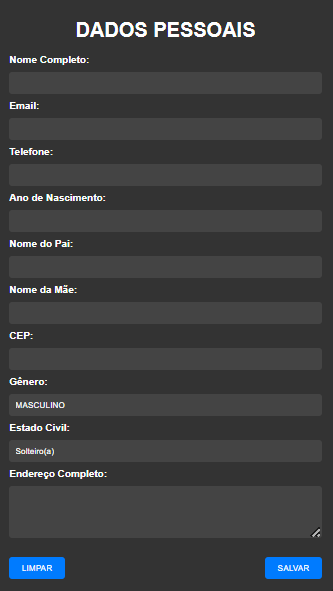

# FORMULARIO DE CADASTRO
🔐SE CADASTRE E SALVE SEUS DADOS EM UM ARQUIVO TXT! 

 <br>

## DESCRIÇÃO:
O "FORMULÁRIO DE CADASTRO" é uma aplicação que permite aos usuários inserir seus dados pessoais em um formulário e salvar esses dados em um arquivo de texto. Aqui estão as principais funcionalidades implementadas:

1. **Preenchimento de Dados Pessoais:**
   - O formulário permite que os usuários insiram informações pessoais, incluindo nome completo, email, telefone, ano de nascimento, nome do pai, nome da mãe, CEP, gênero, estado civil e endereço completo.

2. **Limpar Formulário:**
   - O botão "LIMPAR" permite ao usuário limpar todos os campos do formulário, reiniciando o processo de preenchimento.

3. **Salvar Dados em Arquivo de Texto:**
   - Ao clicar em "SALVAR", os dados inseridos são convertidos em um formato de texto estruturado.
   - Um arquivo de texto contendo os dados é gerado e baixado automaticamente para o dispositivo do usuário com o nome "dados_pessoais.txt".

## COMO USAR?
### BAIXANDO O PROJETO:
* Clone o repositório para o seu sistema local:

```bash
git clone https://github.com/VILHALVA/FORMULARIO-DE-CADASTRO.git
```

* Navegue até o diretório do projeto.

```bash
cd FORMULARIO-DE-CADASTRO
```

* Descompacte o arquivo ZIP (se você baixou manualmente):

```bash
unzip FORMULARIO-DE-CADASTRO.zip
```
* Abra o arquivo `CODIGO.html` em seu navegador de preferência.

### EXECUTANDO O PROJETO:
1. **Preencher o Formulário:**
   - Insira todas as informações pessoais nos campos correspondentes do formulário.

2. **Limpar o Formulário:**
   - Se desejar limpar os campos e recomeçar, clique no botão "LIMPAR".

3. **Salvar os Dados:**
   - Após inserir todos os dados, clique em "SALVAR" para gerar e baixar o arquivo de texto contendo as informações pessoais.

## NÃO SABE?
- Entendemos que para manipular arquivos em `HTML`, `CSS` e outras linguagens relacionadas, é necessário possuir conhecimento nessas áreas. Para auxiliar nesse aprendizado, oferecemos cursos gratuitos disponíveis:
* [Curso de HTML e CSS](https://github.com/VILHALVA/CURSO-DE-HTML-E-CSS)
* [Curso de JavaScript](https://github.com/VILHALVA/CURSO-DE-JAVASCRIPT)
* [Confira mais cursos](https://github.com/VILHALVA?tab=repositories&q=+topic:CURSO)

## CREDITOS:
- [PROJETO CRIADO PELO VILHALVA](https://github.com/VILHALVA)
- [ESTÁ DISPONIVEL NO SITE](https://vilhalva.github.io/STYLER/STYLER.html)

